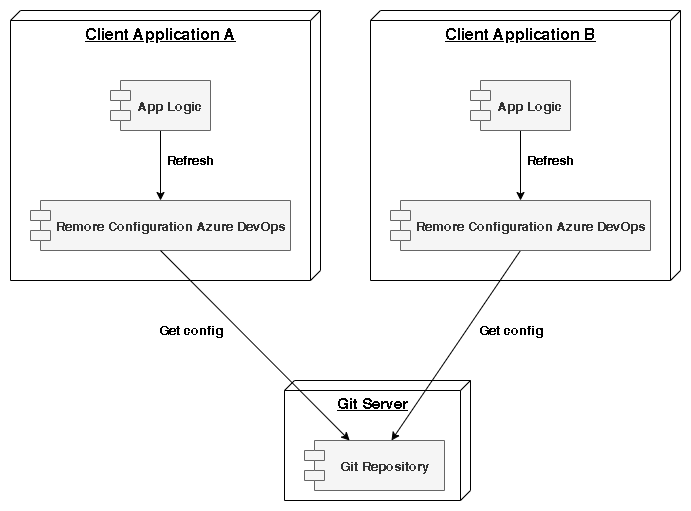

# Remote configuration Library 

Remote Configuration is Spring's library approach for serving distributed configurations across multiple applications and environments.

This configuration store is ideally versioned under Git version control and can be modified at application runtime. While it fits very well in Spring applications using all the supported configuration file formats.



As you can see, the remote configuration lives in its own application. All this application does is request information to Git repositories, from client applications asking for configuration, and return the applicable configuration for those requests.

## requirements

- Repository in azure devops
- Json file with configuration

The file must be versioned in the default branch of the repository. 

### Example : json file

config.json
```
{
    "Test": "test value",
    "List": [
        "Test 1", 
        "Test 2"
    ],
    "flag": true
}
```

## installation

Maven 

```
<dependency>
  <groupId>com.github.davidpolaniaac</groupId>
  <artifactId>azure-devops-remote-configuration</artifactId>
  <version>1.0.0</version>
</dependency>
```
Gradle 
```
implementation 'com.github.davidpolaniaac:azure-devops-remote-configuration:1.0.0'
```

## Setup and use

add a property to the class
```
@Autowired
private final RemoteConfiguration remoteConfiguration;

```
in the appropriate place refer to the configuration information
```
remoteConfiguration.buildConfiguration("organization", "projectId", "Repositorio Name of configuration ", "/config.json", "Basic Auth");

try {
    JsonObject remote = remoteConfiguration.getConfiguration();
    String configuration = remoteConfiguration.getValueConfiguration("Test", String.class);
    String valueOfObject = remoteConfiguration.getValueConfiguration(remote, "Test", String.class);
    LOG.info("Test : " + configuration);
    LOG.info("Test value : " + valueOfObject);
} catch (RemoteConfigurationException e) {
    LOG.error(e.getMessage());
}

```

## summary

Read a config file from your git repository. It is a json file with configuration, flags, etc.


